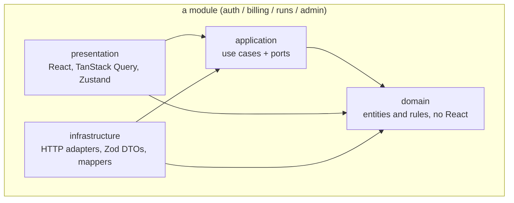
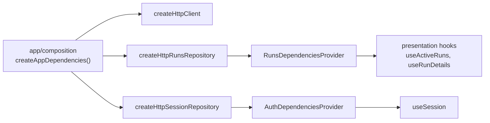

# Frontend architecture

_Русская версия: [FRONTEND_ARCHITECTURE.ru.md](./FRONTEND_ARCHITECTURE.ru.md)_

## 1. Product and scope

The product is a SaaS code review service for GitHub. The backend runs as a GitHub App:
it reacts to pull request events, builds a bounded context around the diff, asks an LLM
for findings, validates them and **publishes them into the pull request** as review
comments and suggestions.

The frontend is not where code review happens — that stays on GitHub. It is the console
of the service:

| Area       | Audience  | Purpose                                               |
| ---------- | --------- | ----------------------------------------------------- |
| Billing    | customers | plans, subscription, seat usage                       |
| Agent runs | customers | runs in flight, history, and what the agent published |
| Admin      | our team  | every subscription, read-only                         |

Out of scope on purpose: reviewing code in our UI, replying to findings, applying
suggestions. All of that lives in the pull request.

## 2. Layers

Clean Architecture is applied **inside each module**, and modules are the top-level unit:



The dependency rule points inwards: `domain` knows nothing, `application` defines the
ports it needs, `infrastructure` implements them, `presentation` calls use cases. Nothing
but `infrastructure` knows that HTTP exists.

## 3. Folder structure

```text
src/
  app/                       composition root
    composition/             builds adapters and hands them to the modules
    config/                  env validated with Zod at startup
    layouts/                 console shell (navigation, org, theme)
    providers/               query client, DI providers, theme
    routes/                  the route tree, guards, typed search params
    styles/                  Tailwind entry point and semantic tokens
  modules/
    auth/                    session, organisations, permissions
    billing/                 plans and subscription (placeholder screens)
    runs/                    agent runs, findings, run details
    admin/                   platform admin area (lazy, isolated)
      domain/ application/ infrastructure/ presentation/ index.ts
  shared/
    diff/                    the diff viewer: domain/ + presentation/
    di/                      generic dependency-injection context factory
    lib/                     http client, error kinds, Intl formatters
    mocks/                   MSW handlers, state snapshot, scenario switch
    ui/                      shadcn/ui components (Radix)
```

Rules, enforced by `eslint-plugin-boundaries` (see `eslint.config.ts`):

- inside a module, imports follow the layer direction above;
- a module may import another module **only through its `index.ts`**;
- `shared/` never imports from `modules/`;
- no module imports `admin`; only the router in `app/` does, lazily.

A violation fails `pnpm lint`, which is what keeps the architecture from eroding.

## 4. Dependency injection

There is no DI container. The composition root builds the adapters and passes them down
through React context:



Use cases are plain functions taking their ports as the first argument, so a test can
call them with an in-memory repository and no React at all.

## 5. State

| Kind                     | Where it lives     | Example                                   |
| ------------------------ | ------------------ | ----------------------------------------- |
| Server data              | TanStack Query     | runs, run details, session                |
| Shareable UI state       | URL (typed search) | status filter, repository, author, search |
| Ephemeral UI state       | Zustand            | unfolded context, collapsed findings      |
| One persisted preference | Zustand + persist  | theme                                     |

Active runs poll every 3 seconds **while anything is still running** and stop on their
own once every run reaches a terminal status:

```ts
refetchInterval: (query) =>
  query.state.data && hasActiveRun(query.state.data) ? 3000 : false;
```

History uses cursor pagination (`useInfiniteQuery`), so a run that starts while you read
never shifts the page under you.

## 6. Data contract

The backend contract is proposed by the frontend and served by MSW until the real API
exists. The diff arrives **structured**, not as raw unified diff text:

```jsonc
{
  "run": {
    "id": "run_8f21",
    "pull_request": {
      "owner": "acme",
      "repo": "payments",
      "number": 412,
      "...": "",
    },
    "status": "completed",
    "stages": [
      { "name": "reviewing", "started_at": "...", "finished_at": "..." },
    ],
    "summary": "…",
    "failure_reason": null,
  },
  "findings": [
    {
      "id": "finding_1",
      "file_path": "src/payment_service.rb",
      "line": 142,
      "side": "RIGHT", // GitHub's LEFT = old file, RIGHT = new file
      "severity": "high",
      "category": "correctness",
      "message": "…",
      "suggestion": { "before": ["…"], "after": ["…"] },
      "external_url": "https://github.com/acme/payments/pull/412#discussion_r1",
      "snippet": {
        "path": "…",
        "status": "modified",
        "hunks": [{ "lines": ["…"] }],
      },
      "file_line_count": 180,
    },
  ],
}
```

Endpoints: `GET /api/me`, `GET /api/runs/active`, `GET /api/runs`, `GET /api/runs/:id`,
`GET /api/runs/:id/file-lines?path=&from=&to=` (unfolding context).

Every response passes a Zod schema in `infrastructure/dto.ts` before mappers turn it into
domain types. Findings whose position is not part of their snippet are **dropped**, the
same check the backend performs before publishing a comment
(`isPositionInDiff`, `toValidFindings`).

## 7. Diff viewer

```text
FindingCard                     severity, category, collapse  (modules/runs)
└── DiffSnippet                 file fragment                 (shared/diff)
    ├── DiffFileHeader          path, status, link to GitHub
    ├── ExpandContextRow        "↑ 20 lines", "All", hidden line count
    ├── DiffHunk                @@ header + lines
    │   └── DiffLine            gutters, +/- marker, highlight, anchor
    │       └── LineContent     the text — the single extension point for
    │                           syntax highlighting later
    ├── InlineFinding           the agent's comment under its line
    └── SuggestionBlock         proposed change as a mini diff
```

Pure logic in `shared/diff/domain` (covered by tests):

| Function             | What it answers                                              |
| -------------------- | ------------------------------------------------------------ |
| `getContextGaps`     | which unchanged stretches can be unfolded, and how big       |
| `expandRange`        | which line range one "unfold" click should fetch             |
| `mergeExpandedLines` | how fetched lines merge back, keeping both numberings right  |
| `findLinePosition`   | which line a finding points at                               |
| `isPositionInDiff`   | whether a finding position exists in the diff at all         |
| `positionAnchorId`   | the deep-link id for a line (`#src-payment_service-rb-R142`) |

Deliberately left out for now, with the seams kept open: syntax highlighting (only
`LineContent` changes), split view (`DiffLine` already takes a side), word-level diff,
virtualisation.

## 8. Application state mock

`src/shared/mocks/state.ts` is the typed snapshot the DoD asks for: a session per role, an
active run, a completed run with three findings (including a suggestion), a failed run
with a reason, and a page of history. It is written in the wire format, so it exercises the
Zod schemas and the mappers exactly like a real backend would — including one finding
pointing outside the diff, which the mappers must drop.

`?mock=owner|member|admin|idle` (or the panel in the corner) switches role and whether any
runs are active, which is how guards and empty states are checked without editing
fixtures.

## 9. Tooling

pnpm 12 · Node ≥ 24 · React 19 · Vite 8 · TypeScript 6 · TanStack Router and Query ·
Zustand · Zod 4 · Tailwind v4 + shadcn/ui (Radix) · MSW · Vitest.

`pnpm lint` (ESLint 10, type-aware, with architecture boundaries), `pnpm lint:css`,
`pnpm check-types`, `pnpm test`, `pnpm build`. Husky runs lint-staged on commit and the
full set on push; commit messages follow Conventional Commits. The same checks, plus
`format:check`, run on every pull request in GitHub Actions — hooks can be skipped with
`--no-verify`, CI cannot.

## 10. Decisions and their reasons

| Decision                                   | Why                                                                         |
| ------------------------------------------ | --------------------------------------------------------------------------- |
| Clean Architecture inside vertical modules | billing, runs and admin share almost nothing; each stays in one folder      |
| Manual DI over a container                 | no decorators, no runtime magic, trivial to fake in tests                   |
| Query for server state, Zustand for UI     | one cache, no duplicated server data                                        |
| Filters in the URL                         | a filtered history is a shareable link                                      |
| Polling instead of SSE                     | works against any backend today; the cadence is invisible to the user       |
| Structured diff from the API               | unambiguous line numbers; position validation without parsing on the client |
| Stripe hosted checkout                     | no card data ever reaches our UI                                            |
| Read-only admin area                       | Stripe stays the source of truth for money                                  |
| No syntax highlighting yet                 | costly on CPU and in scope; the extension point is one component            |

## 11. Next steps

Billing screens and Stripe redirects, the admin table, the public pricing page, syntax
highlighting, split view, SSE instead of polling, component and e2e tests.
