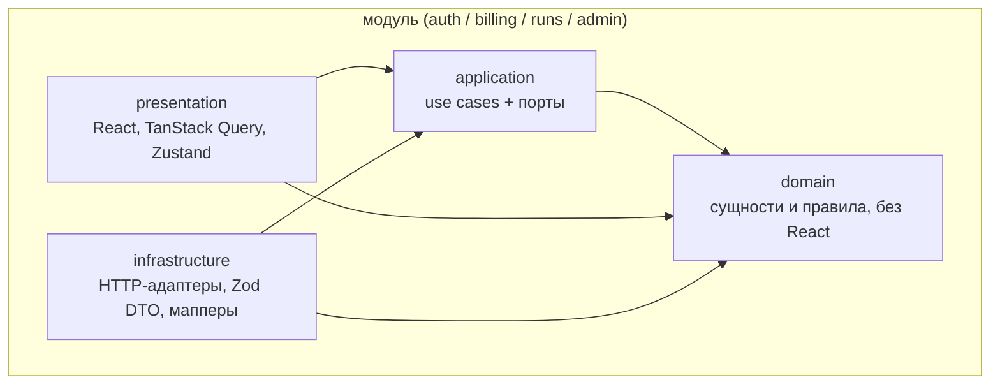
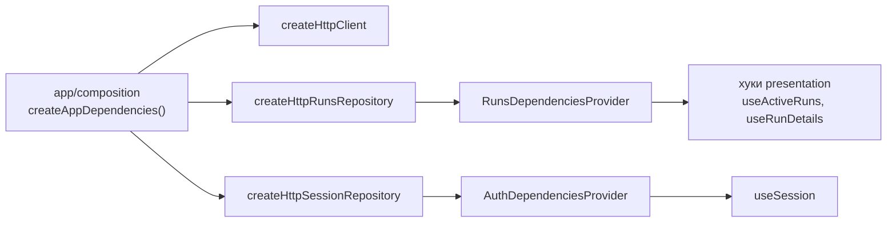

# Архитектура фронтенда

_English version: [FRONTEND_ARCHITECTURE.md](./FRONTEND_ARCHITECTURE.md)_

## 1. Продукт и границы

Продукт — SaaS-сервис code review для GitHub. Бэкенд работает как GitHub App: реагирует на
события pull request, собирает ограниченный контекст вокруг диффа, просит LLM найти
проблемы, проверяет результат и **публикует findings прямо в pull request** — в виде
review-комментариев и suggestions.

Фронтенд — не место, где проходит ревью: ревью остаётся на GitHub. Это консоль сервиса:

| Раздел  | Для кого     | Зачем                                                 |
| ------- | ------------ | ----------------------------------------------------- |
| Биллинг | клиенты      | тарифы, подписка, использование мест (seats)          |
| Запуски | клиенты      | активные запуски, история и то, что агент опубликовал |
| Админка | наша команда | все подписки, только просмотр                         |

Сознательно вне объёма: ревью кода в нашем UI, ответы на findings, применение suggestions.
Всё это живёт в pull request.

## 2. Слои

Clean Architecture применяется **внутри каждого модуля**, а модули — верхний уровень нарезки:



Зависимости направлены внутрь: `domain` не знает ни о чём, `application` объявляет нужные
ему порты, `infrastructure` их реализует, `presentation` вызывает use cases. О существовании
HTTP знает только `infrastructure`.

## 3. Структура папок

```text
src/
  app/                       composition root
    composition/             сборка адаптеров и передача их модулям
    config/                  env, валидируется Zod при старте
    layouts/                 оболочка консоли (навигация, организация, тема)
    providers/               query client, DI-провайдеры, тема
    routes/                  дерево маршрутов, guards, типизированные search-параметры
    styles/                  входной файл Tailwind и семантические токены
  modules/
    auth/                    сессия, организации, права
    billing/                 тарифы и подписка (пока заглушки)
    runs/                    запуски агента, findings, страница запуска
    admin/                   админка платформы (ленивая, изолированная)
      domain/ application/ infrastructure/ presentation/ index.ts
  shared/
    diff/                    просмотрщик диффа: domain/ + presentation/
    di/                      generic-фабрика DI-контекста
    lib/                     http-клиент, типы ошибок, форматирование через Intl
    mocks/                   MSW-хендлеры, снимок состояния, переключатель сценариев
    ui/                      компоненты shadcn/ui (Radix)
```

Правила, которые проверяет `eslint-plugin-boundaries` (см. `eslint.config.ts`):

- внутри модуля импорты идут по направлению слоёв выше;
- модуль может импортировать другой модуль **только через его `index.ts`**;
- `shared/` никогда не импортирует из `modules/`;
- ни один модуль не импортирует `admin`, это делает только роутер в `app/`, лениво.

Нарушение роняет `pnpm lint` — именно это не даёт архитектуре размыться.

## 4. Внедрение зависимостей

DI-контейнера нет. Composition root создаёт адаптеры и передаёт их вниз через React context:



Use cases — обычные функции, принимающие порты первым аргументом, поэтому тест вызывает их
с in-memory репозиторием и вообще без React.

## 5. Состояние

| Вид состояния                      | Где живёт                   | Пример                                 |
| ---------------------------------- | --------------------------- | -------------------------------------- |
| Данные с сервера                   | TanStack Query              | запуски, детали запуска, сессия        |
| То, чем делятся по ссылке          | URL (типизированный search) | фильтр статуса, репозиторий, автор     |
| Эфемерное UI-состояние             | Zustand                     | раскрытый контекст, свёрнутые findings |
| Единственная сохраняемая настройка | Zustand + persist           | тема                                   |

Активные запуски опрашиваются раз в 3 секунды, **пока хоть что-то выполняется**, и
останавливаются сами, когда все запуски дошли до конечного статуса:

```ts
refetchInterval: (query) =>
  query.state.data && hasActiveRun(query.state.data) ? 3000 : false;
```

История листается курсором (`useInfiniteQuery`), поэтому запуск, начавшийся во время
чтения, не сдвигает страницу под читателем.

## 6. Контракт данных

Контракт предлагает фронтенд, а отдаёт его MSW, пока нет настоящего API. Дифф приходит
**структурированным**, а не текстом unified diff:

```jsonc
{
  "run": {
    "id": "run_8f21",
    "pull_request": {
      "owner": "acme",
      "repo": "payments",
      "number": 412,
      "...": "",
    },
    "status": "completed",
    "stages": [
      { "name": "reviewing", "started_at": "...", "finished_at": "..." },
    ],
    "summary": "…",
    "failure_reason": null,
  },
  "findings": [
    {
      "id": "finding_1",
      "file_path": "src/payment_service.rb",
      "line": 142,
      "side": "RIGHT", // в терминах GitHub: LEFT — старый файл, RIGHT — новый
      "severity": "high",
      "category": "correctness",
      "message": "…",
      "suggestion": { "before": ["…"], "after": ["…"] },
      "external_url": "https://github.com/acme/payments/pull/412#discussion_r1",
      "snippet": {
        "path": "…",
        "status": "modified",
        "hunks": [{ "lines": ["…"] }],
      },
      "file_line_count": 180,
    },
  ],
}
```

Эндпоинты: `GET /api/me`, `GET /api/runs/active`, `GET /api/runs`, `GET /api/runs/:id`,
`GET /api/runs/:id/file-lines?path=&from=&to=` (раскрытие контекста).

Каждый ответ проходит Zod-схему из `infrastructure/dto.ts`, и только потом мапперы
превращают его в доменные типы. Findings, чья позиция отсутствует в приложенном фрагменте
диффа, **отбрасываются** — это та же проверка, которую бэкенд делает перед публикацией
комментария (`isPositionInDiff`, `toValidFindings`).

## 7. Просмотрщик диффа

```text
FindingCard                     severity, category, свернуть        (modules/runs)
└── DiffSnippet                 фрагмент файла                      (shared/diff)
    ├── DiffFileHeader          путь, статус, ссылка на GitHub
    ├── ExpandContextRow        «↑ 20 строк», «All», число скрытых строк
    ├── DiffHunk                заголовок @@ и строки
    │   └── DiffLine            gutter, маркер +/-, подсветка, анкор
    │       └── LineContent     текст строки — единственная точка расширения
    │                           для будущей подсветки синтаксиса
    ├── InlineFinding           комментарий агента под своей строкой
    └── SuggestionBlock         предложенная замена как мини-дифф
```

Чистая логика в `shared/diff/domain` (покрыта тестами):

| Функция              | На какой вопрос отвечает                                            |
| -------------------- | ------------------------------------------------------------------- |
| `getContextGaps`     | какие неизменённые промежутки можно раскрыть и насколько они велики |
| `expandRange`        | какой диапазон строк запросить по одному клику                      |
| `mergeExpandedLines` | как вклеить подгруженные строки, сохранив обе нумерации             |
| `findLinePosition`   | на какую строку указывает finding                                   |
| `isPositionInDiff`   | существует ли позиция finding в диффе вообще                        |
| `positionAnchorId`   | id для ссылки на строку (`#src-payment_service-rb-R142`)            |

Сознательно отложено, но швы оставлены: подсветка синтаксиса (меняется только
`LineContent`), split-режим (`DiffLine` уже принимает сторону), пословный дифф,
виртуализация.

## 8. Мок состояния приложения

`src/shared/mocks/state.ts` — типизированный снимок, которого требует DoD: сессия под каждую
роль, активный запуск, завершённый запуск с тремя findings (один с suggestion), упавший
запуск с причиной и страница истории. Он написан в формате контракта, поэтому проходит через
Zod-схемы и мапперы ровно так же, как ответ настоящего бэкенда, — включая один finding с
позицией вне диффа, который мапперы обязаны отбросить.

`?mock=owner|member|admin|idle` (или панель в углу) переключает роль и наличие активных
запусков: так проверяются guards и пустые состояния без правки фикстур.

## 9. Инструменты

pnpm 12 · Node ≥ 24 · React 19 · Vite 8 · TypeScript 6 · TanStack Router и Query ·
Zustand · Zod 4 · Tailwind v4 + shadcn/ui (Radix) · MSW · Vitest.

`pnpm lint` (ESLint 10 с проверкой типов и границами слоёв), `pnpm lint:css`,
`pnpm check-types`, `pnpm test`, `pnpm build`. Husky запускает lint-staged на коммите и
полный набор на пуше, сообщения коммитов — Conventional Commits. Те же проверки плюс
`format:check` выполняются в GitHub Actions на каждом pull request: хуки можно обойти через
`--no-verify`, CI — нет.

## 10. Решения и их причины

| Решение                                        | Почему                                                               |
| ---------------------------------------------- | -------------------------------------------------------------------- |
| Clean Architecture внутри вертикальных модулей | у billing, runs и admin почти нет общего; каждый лежит в одной папке |
| Ручной DI вместо контейнера                    | без декораторов и магии в рантайме, легко подменить в тестах         |
| Query для сервера, Zustand для UI              | один кэш, никакого дублирования серверных данных                     |
| Фильтры в URL                                  | отфильтрованная история — это ссылка, которой можно поделиться       |
| Polling вместо SSE                             | работает с любым бэкендом уже сейчас, пользователь разницы не видит  |
| Структурированный дифф от API                  | однозначные номера строк, валидация позиций без парсинга на клиенте  |
| Stripe hosted checkout                         | карточные данные никогда не попадают в наш UI                        |
| Админка только для чтения                      | источник правды по деньгам остаётся в Stripe                         |
| Пока без подсветки синтаксиса                  | дорого по CPU и по объёму; точка расширения — один компонент         |

## 11. Что дальше

Экраны биллинга и редиректы в Stripe, таблица админки, публичная страница тарифов,
подсветка синтаксиса, split-режим, SSE вместо polling, компонентные и e2e тесты.
