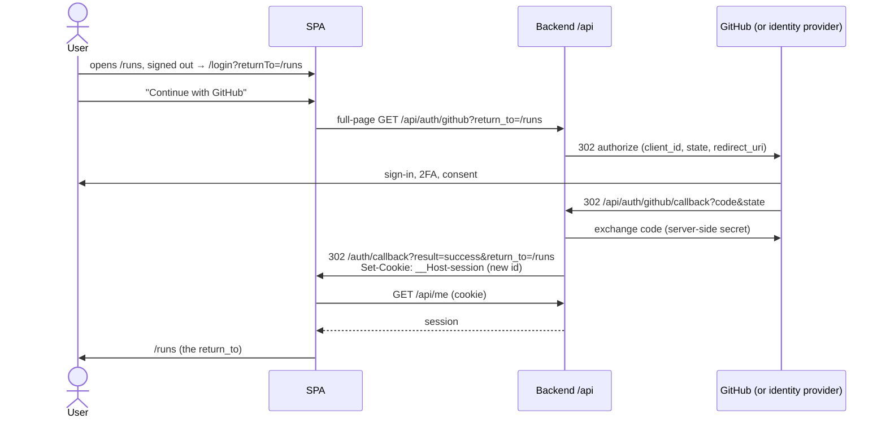

# Spec 001 — Sign in with GitHub

_Status: ready for implementation · Depends on: FRONTEND_ARCHITECTURE.md (modules, DI, state) · Owner: frontend_

## 1. Goal

A visitor signs in with their GitHub account and returns to the page they were trying to
open. Someone who signs in directly from `/login` lands on a basic "signed in" page that
shows who they are and which organisations the review app is installed in.

The session is a **cookie-only session**: the backend keeps it in an `HttpOnly` cookie,
and the client never sees, stores or sends a token itself.

## 2. Scope

In scope:

- "Continue with GitHub" on `/login`, the OAuth round trip, and the return to the SPA.
- A sign-in success page at `/auth/success`.
- Sign-out.
- Detecting an expired or revoked session anywhere in the app.
- Error states for a failed or cancelled sign-in.
- MSW mocks for every endpoint below, so the flow works with `VITE_ENABLE_MOCKS=true`.

Out of scope: switching organisations, installing the GitHub App, roles and permissions
beyond "signed in or not", billing, runs, admin.

## 3. Key decision: cookie-only session

The backend runs the whole OAuth flow and keeps every credential. The browser only
carries an opaque session cookie that JavaScript cannot read.

The backend may authenticate through a GitHub App, an OAuth App or an identity broker
sitting in front of GitHub. The SPA's contract (§5) is the same in every case: it starts
sign-in at one URL and reads the outcome from one redirect. Two-factor authentication
(an authenticator app, a security key) happens on GitHub's or the provider's pages and is
invisible to the SPA.

| Credential        | Issued by | Stored in                                                     | JS can read it |
| ----------------- | --------- | ------------------------------------------------------------- | -------------- |
| GitHub user token | GitHub    | backend only                                                  | never          |
| Session cookie    | backend   | `__Host-session`: `HttpOnly; Secure; SameSite=Strict; Path=/` | no             |

Why cookie-only rather than a token held by the client:

- Script injected through an XSS hole cannot steal a credential. It can still act while
  the page is open, so the CSP in §8 is still required.
- No token handling in the client: no refresh endpoint, no coordination between tabs, no
  `Authorization` header.
- The backend can revoke a session instantly, because sessions live in a server-side
  store.

The cost is protection against cross-site request forgery (CSRF), since the browser
attaches the cookie automatically. §8 handles it with `SameSite=Strict`, an `Origin`
check and a required custom header.

Decided: the SPA and `/api` are served from the **same site** (a reverse proxy), which is
what makes `SameSite=Strict` and the `__Host-` prefix possible.

The client already assumes this model: `credentials: "include"` in `shared/lib/http.ts`,
and the comments in `http.ts` and `login-page.tsx`. The architecture doc does not describe
auth yet (§11).

## 4. Flow



The redirect back to the SPA carries only the outcome, never a credential.

Where the user ends up after a successful sign-in:

1. If the session has no organisation (`current_organization_id` is `null`) →
   `/auth/success`, which shows the "not installed yet" state. The console has nothing to
   show them.
2. Otherwise → the sanitised `return_to`.
3. If there was no `return_to` (the user opened `/login` directly) → `/auth/success`.

## 5. API contract

All paths are relative to `VITE_API_BASE_URL`.

Every request from the SPA sends the session cookie and the header
`X-Requested-With: fetch`.

| Endpoint                    | Caller             | Request                   | Response                                                                                                             |
| --------------------------- | ------------------ | ------------------------- | -------------------------------------------------------------------------------------------------------------------- |
| `GET /auth/github`          | browser navigation | `?return_to=<path>`       | `302` to GitHub. Sets a short-lived `SameSite=Lax` cookie that binds `state` (and the PKCE verifier).                |
| `GET /auth/github/callback` | GitHub redirect    | `?code&state` or `?error` | `302` to `/auth/callback?result=…&return_to=…`. On success it creates a **new** session and sets the session cookie. |
| `GET /me`                   | SPA `fetch`        | cookie                    | `200` session (below) · `401` when signed out                                                                        |
| `POST /auth/logout`         | SPA `fetch`        | cookie + header           | `204`: the backend deletes the session and expires the cookie                                                        |

`result` on `/auth/callback` is one of `success`, `access_denied` (the user cancelled on
GitHub or at the provider), `state_mismatch` or `server_error`. Whatever provider the
backend uses, its errors map to these four values.

**Session lifetime**: 1 hour, configurable on the backend (e.g. `SESSION_TTL_SECONDS`,
default `3600`). It is a sliding idle timeout: every authenticated request extends it,
and the cookie's `Max-Age` is re-sent to match. The server-side session store decides;
the cookie's `Max-Age` only keeps the browser from holding a dead cookie. When the session
runs out, any endpoint answers `401`. The SPA never reads or hard-codes the lifetime, so
changing it needs no frontend release.

`GET /me` response:

```jsonc
{
  "user": {
    "id": "u_1",
    "login": "octocat",
    "name": "Octo Cat",
    "avatar_url": "https://avatars.githubusercontent.com/u/1",
    "is_platform_admin": false,
  },
  "organizations": [
    {
      "id": "org_1",
      "login": "acme",
      "name": "Acme",
      "avatar_url": "https://…",
      "role": "owner", // "owner" | "member"
    },
  ],
  "current_organization_id": "org_1", // null when the app is installed nowhere
}
```

`current_organization_id` becomes **nullable**: a user can sign in before any organisation
has installed the app.

## 6. Routes and screens

| Route            | Access    | Behaviour                                                                                                                                                                                        |
| ---------------- | --------- | ------------------------------------------------------------------------------------------------------------------------------------------------------------------------------------------------ |
| `/login`         | public    | "Continue with GitHub". Shows an error banner for `?error=<result>`. Already signed in → the destination rules in §4.                                                                            |
| `/auth/callback` | public    | Not a visible page: a spinner while it loads `/me`. Success → the destination rules in §4, using `replace` so Back does not return here. Any failure, or a `401` from `/me`, → `/login?error=…`. |
| `/auth/success`  | signed in | The "signed in" page (below).                                                                                                                                                                    |

`/auth/success` shows:

- the avatar, name and `@login`;
- the organisations with their role; when the list is empty, "The review app is not
  installed in any of your organisations yet";
- "Go to the console" → `/runs`, hidden when there are no organisations;
- "Sign out".

Loading uses skeletons; every error state offers a way back to `/login`.

## 7. Client behaviour

**Session state**: the session (from `GET /me`) lives in TanStack Query under the existing
`["session"]` key. It is the only auth state in the client.

- The console guard uses a normal `staleTime` (5 minutes), not `"static"`, so a revoked
  session is noticed on the next navigation after that.
- `401` from `/me` means "signed out" and resolves to `null`, not to an error.

**HTTP client** (`shared/lib/http`):

- Keeps `credentials: "include"` and adds `X-Requested-With: fetch` to every request.
- Accepts `204 No Content` without parsing a body.
- Accepts an injected `onUnauthorized()` callback. It cannot import the auth module, so
  the composition root passes the callback in.
- A `401` from any endpoint other than `/me` calls `onUnauthorized()` and still rejects
  with `AppError("unauthorized")`.

**`onUnauthorized`** (wired in `app/`): set the session query to `null`, remove every
other query, and navigate to `/login?returnTo=<current path>`. Repeated `401`s within one
navigation trigger only one redirect.

**Sign-out**:

1. `POST /auth/logout`. A network failure is ignored; the user is signed out locally
   either way.
2. `queryClient.clear()`.
3. Post `signed-out` on `BroadcastChannel("auth")`. Other tabs clear their cache and go
   to `/login`; their cookie is already gone.
4. Navigate to `/login`.

**`return_to` sanitising** (a pure function in `domain`, applied by both the SPA and the
backend): the value must start with `/`, must not start with `//` or `/\`, and must not
contain control characters, and must not point at `/login` or `/auth/*`. Anything else
counts as "no `return_to`" (§4, rule 3).

## 8. Security requirements

1. The session cookie is `__Host-session; HttpOnly; Secure; SameSite=Strict; Path=/`.
   The `__Host-` prefix pins it to the exact origin, with no `Domain` attribute.
2. The backend issues a **new** session id on every sign-in (no session fixation) and
   deletes the session server-side on sign-out. A copied cookie value stops working
   immediately.
3. CSRF: every state-changing request (`POST`, `PUT`, `PATCH`, `DELETE`) must carry
   `X-Requested-With` and an `Origin` that matches the app. The backend rejects anything
   else with `403`. `GET` requests never change state.
4. The OAuth `state` (and PKCE, where the provider supports it) is generated, bound to a
   cookie and checked by the backend or its identity provider. The SPA never sees or
   checks it.
5. The API sends `Cache-Control: no-store` on authenticated responses, so after sign-out
   the back button cannot show private data.
6. A strict CSP in production: `script-src 'self'`, no `unsafe-inline` or `unsafe-eval`,
   `connect-src 'self'`, `frame-ancestors 'none'`. Also
   `Referrer-Policy: strict-origin-when-cross-origin`.
7. External URLs from `/me` (avatars) are rendered only with `https:`.
8. No token, cookie value or GitHub `code` in logs, error messages or analytics.

## 9. Architecture placement

| Layer                 | Addition                                                                                                                                      |
| --------------------- | --------------------------------------------------------------------------------------------------------------------------------------------- |
| `auth/domain`         | `Session.currentOrganizationId: string \| null`; `sanitizeReturnTo()`; `SignInResult` union                                                   |
| `auth/application`    | `SessionRepository` gains `signOut()`; use cases `signOut`, `resolveSignInResult`                                                             |
| `auth/infrastructure` | `/me` DTO update (nullable org id); `signOut` via `POST /auth/logout`                                                                         |
| `auth/presentation`   | `AuthCallbackPage`, `SignInSuccessPage`, the login error banner, a sign-out button, the `BroadcastChannel` listener                           |
| `shared/lib/http`     | the `X-Requested-With` header, `204` support, the `onUnauthorized` hook                                                                       |
| `app/composition`     | passes `onUnauthorized` to the HTTP client and connects it to the query client and router once they exist                                     |
| `app/routes`          | `/auth/callback` and `/auth/success`; the guard's `staleTime` changes from `"static"` to 5 minutes; `returnTo` sanitised in the search schema |
| `shared/mocks`        | handlers and scenarios (below)                                                                                                                |

**Mocks**: MSW does not intercept full-page navigations, so in mock mode the sign-in URL
points straight at `/auth/callback?result=<scenario>&return_to=…`, skipping GitHub. The switch lives
in the composition root, not in the auth module. The mock "session" is a flag in the mock
state: `/auth/logout` clears it, and `/me` then answers `401`.

New `?mock=` scenarios:

- `signed-out`: `/me` answers `401` until sign-in;
- `denied`: sign-in returns `result=access_denied`;
- `no-orgs`: `current_organization_id` is `null`;
- `expired`: the second API call answers `401`.

## 10. Acceptance criteria

1. A signed-out user who opens `/runs` is redirected to `/login?returnTo=/runs`. After
   signing in they land on `/runs` directly, and Back does not return to
   `/auth/callback`. A user who opens `/login` directly lands on `/auth/success`.
2. The session cookie is `HttpOnly`, `Secure` and `SameSite=Strict` (DevTools →
   Application), and absent from `document.cookie`. No credential appears in storage APIs,
   URLs or the history.
3. Reloading `/auth/success` keeps the user signed in with a single `GET /me`.
4. When the session expires (more than 1 hour without an authenticated request, with
   the default setting) or is revoked server-side, the next API call lands the user on
   `/login` with their path preserved, instead of an error box. Signing in again returns
   them to that path.
5. Cancelling on GitHub shows "Sign-in was cancelled" on `/login`. `state_mismatch` and
   `server_error` show a generic message and a retry button.
6. `returnTo=https://evil.example`, `//evil.example`, `/\evil.example` and
   `/auth/callback` all end at `/auth/success`.
7. Sign-out in one tab signs out every open tab. Replaying the old cookie value returns
   `401`, and the back button shows no private data.
8. A user with no organisations lands on `/auth/success` with the "not installed yet"
   state, whatever their `return_to` was.
9. A `POST` without `X-Requested-With`, or from a foreign `Origin`, gets `403`. This is a
   backend criterion, checked with the backend team.
10. `pnpm check-types`, `pnpm lint` and `pnpm test` pass. A normal `pnpm build` contains no
    mock handlers.

## 11. Tests and documentation

Unit tests (Vitest, no React):

- `sanitizeReturnTo`;
- the destination rules in §4: with and without `return_to`, with and without
  organisations;
- mapping the `result` parameter to a `SignInResult`;
- the HTTP client: the `X-Requested-With` header, `204` handling, `onUnauthorized` on
  `401` but not for `/me`, and a single redirect for several simultaneous `401`s.

Scenario checks with MSW: every scenario in §9.

Documentation in the same PR, in FRONTEND_ARCHITECTURE.md (both languages):

- a short auth section: the flow, the cookie-only decision, the CSRF rule;
- the §6 endpoints of this spec;
- "session: TanStack Query, cookie-backed" in the §5 state table.

## 12. Decisions

| #   | Question                                     | Decision (2026-10-03)                                                                                                    |
| --- | -------------------------------------------- | ------------------------------------------------------------------------------------------------------------------------ |
| 1   | Are the SPA and API same-site?               | Yes, served behind one reverse proxy (§3).                                                                               |
| 2   | Session lifetime                             | 1-hour **idle** timeout, extended by every authenticated request; no absolute maximum; configurable on the backend (§5). |
| 3   | Identity provider                            | Not fixed: a GitHub App, an OAuth App or an identity broker. The SPA contract does not depend on it (§3).                |
| 4   | Show a page between sign-in and `return_to`? | No: redirect straight to `return_to`. `/auth/success` remains for direct sign-ins and users without organisations (§4).  |

No open questions remain.
